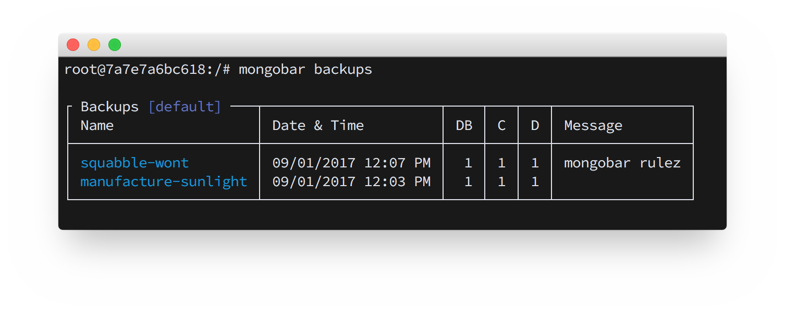
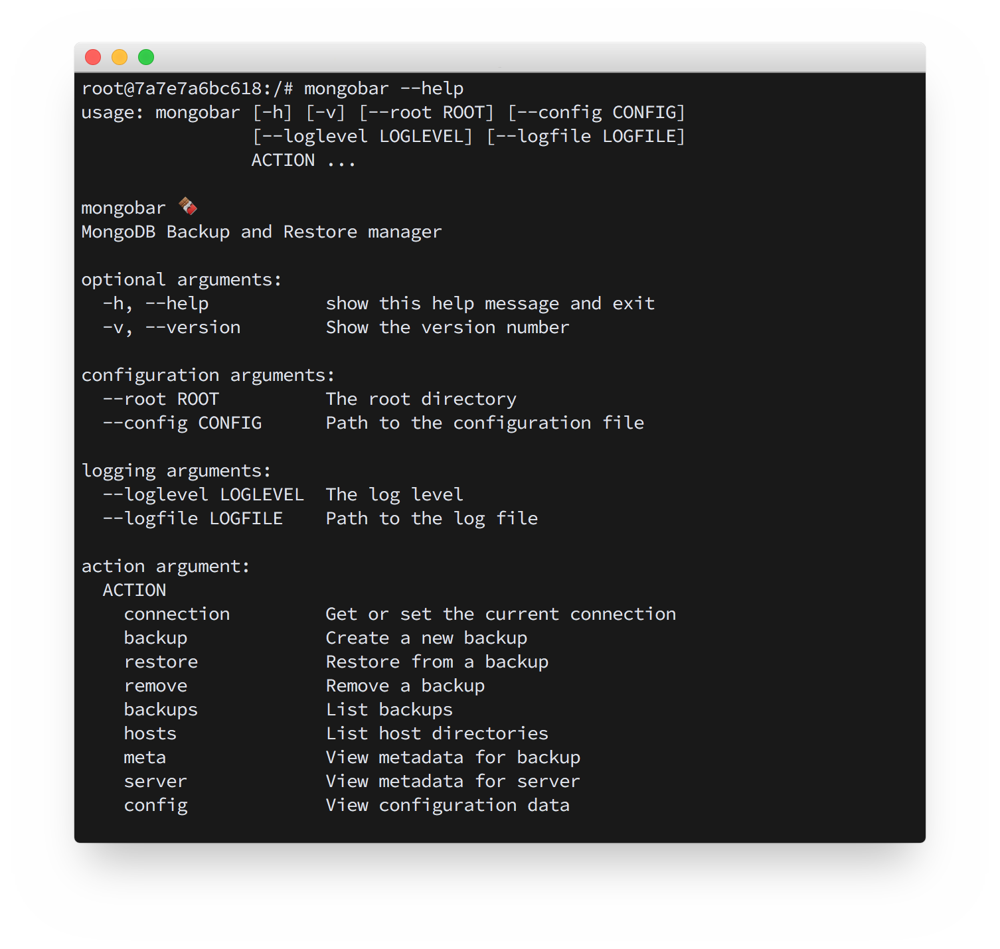
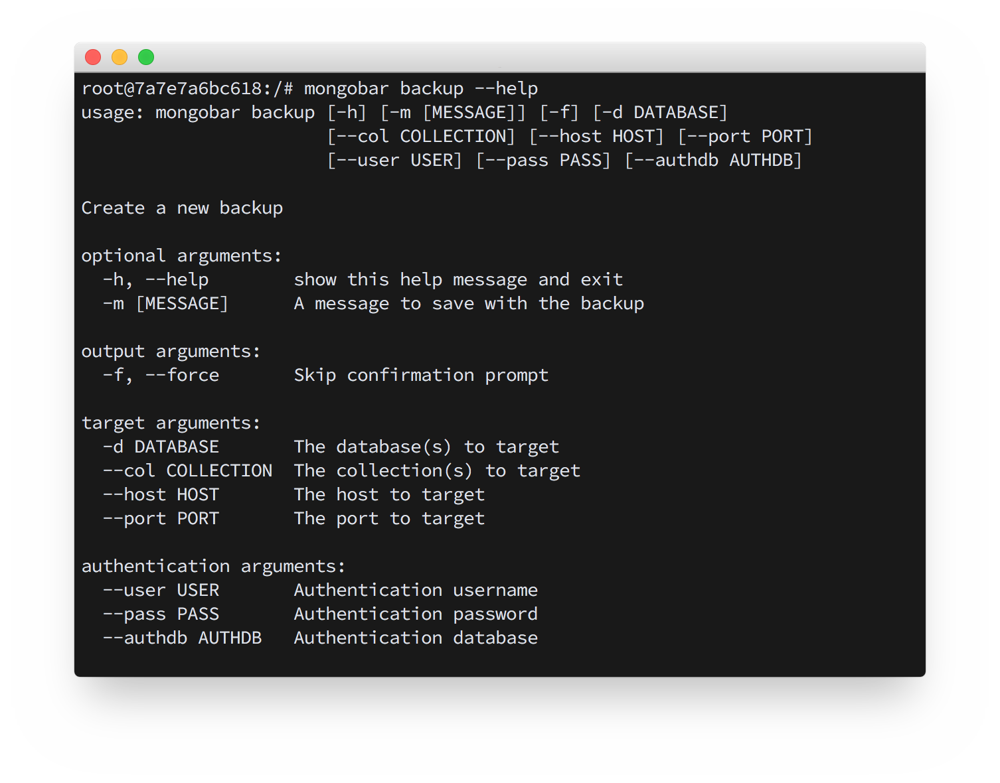
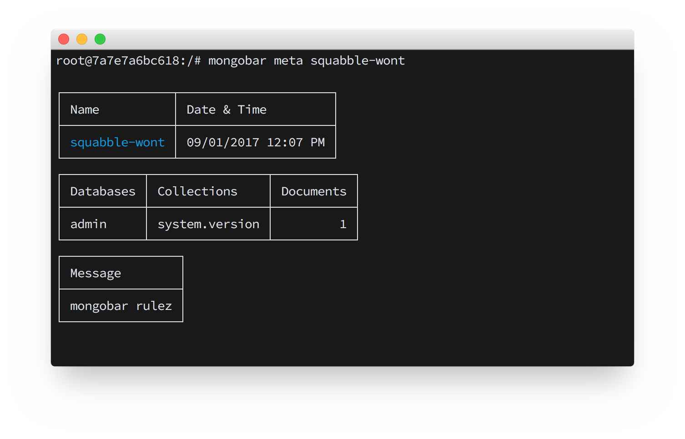
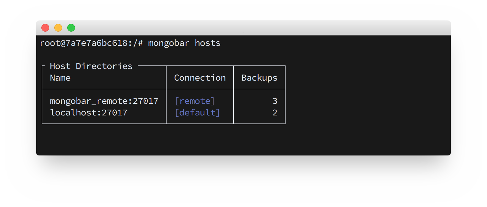
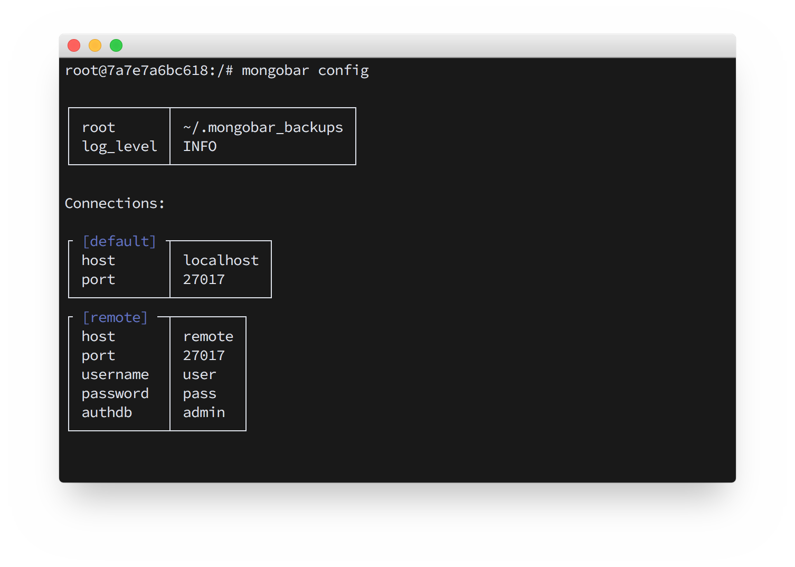
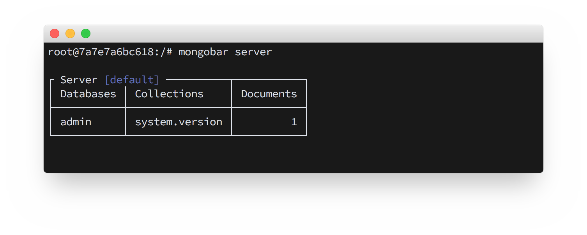

## mongobar 0.0.5

mongobar is a python shell script used to create and manage MongoDB backups. Internally it is a wrapper for the MongoDB  **mongodump** and **mongorestore** commands.  

## Installation
```
pip install mongobar
```
## Usage
Run `mongobar` in a terminal

## Help
Access help via the `-h --help` commands. All actions have associated help text.  

`mongobar --help`  
  
`mongobar backup --help`  
    

## Configuration
mongobar comes with a default configuration that defines a `Connection` for a MongoDB server running on **localhost:27017** with authentication disabled. Here is what that config looks like:
```json
{
    "root": "~/.mongobar_backups",
    "log_level": "INFO",
    "connections": {
        "default": {
            "host": "localhost",
            "port": 27017
        }
    }
}
```
The `default` connection can be overridden and additional  connections can be added by writing a config file. Here is an example of a custom config:
```json
{
    "connections": {
        "default": {
            "host": "localhost",
            "port": 27017,
            "username": "user",
            "password": "pass",
            "authdb": "admin"
        },
        "production": {
            "host": "102.100.204.35",
            "port": 27017,
            "username": "user",
            "password": "pass",
            "authdb": "admin"
        }
    }
}
```
mongobar will try to load a config file from `~/.mongobar_config.json` by default. This path can be changed by using the `--config` flag. The current configuration can be viewed by running the `config` action.

## Connections
mongobar uses the `connection` action to view and set the **current connection**. This attribute is used by actions `backup`, `restore`, `remove`, `backups`, `hosts`, and `meta`. Connections are defined in the configuration file and can be viewed by running the `config` action.

## Examples

#### `mongobar backups`
View backups


#### `mongobar meta <backup name>`
View backup metadata


#### `mongobar hosts`
View host directories


#### `mongobar config`
View configuration


#### `mongobar server`
View server metadata

